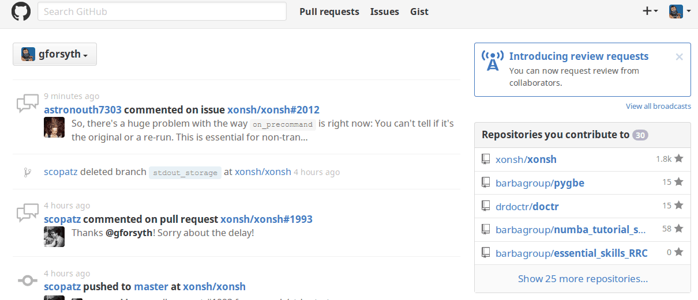
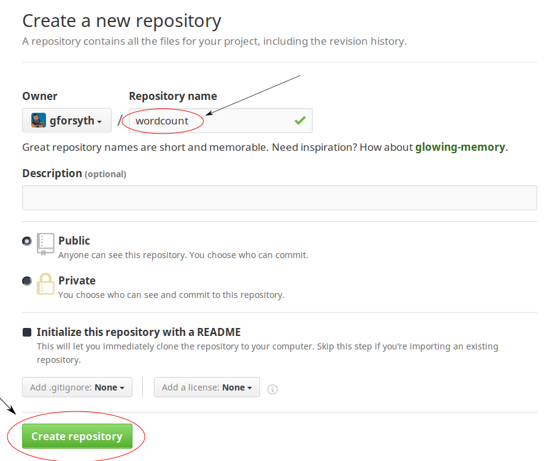
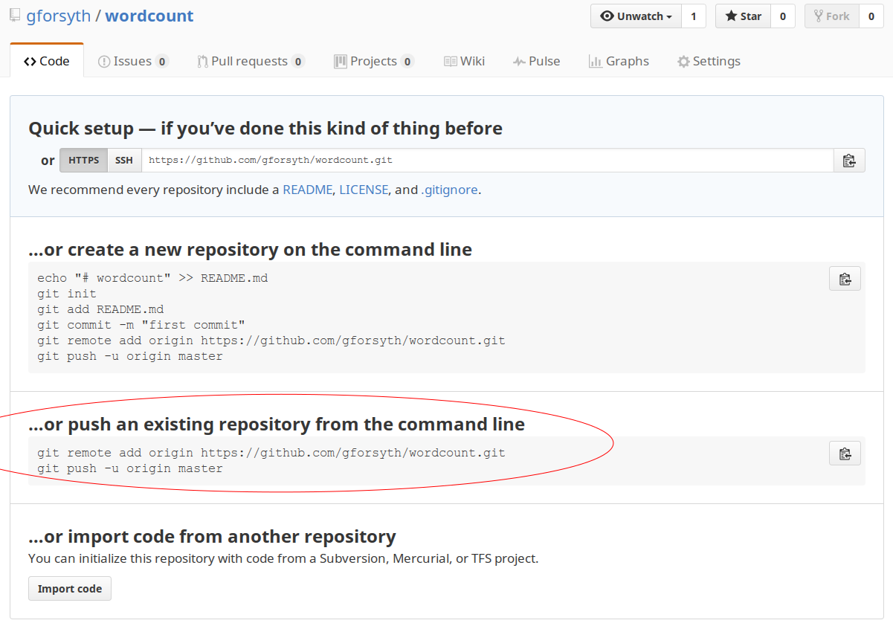
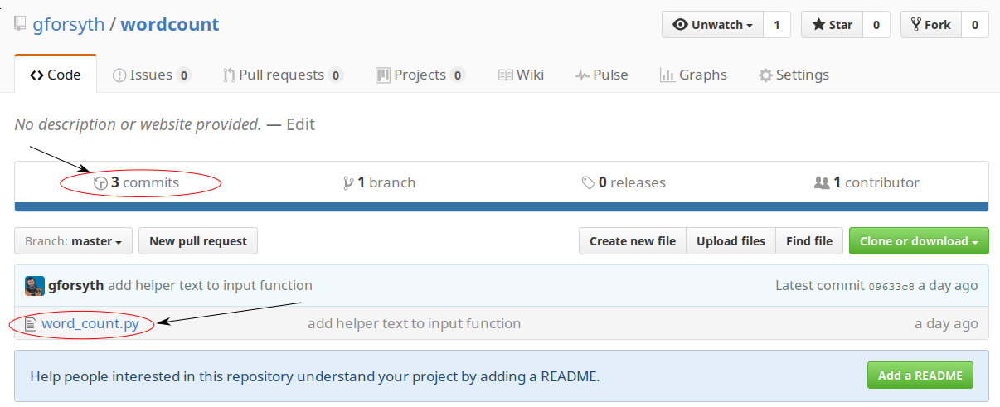
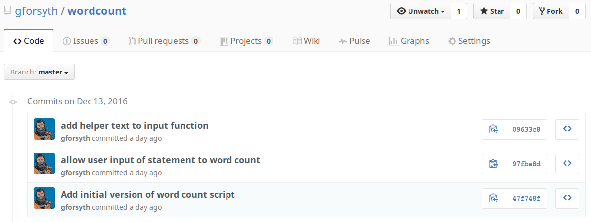
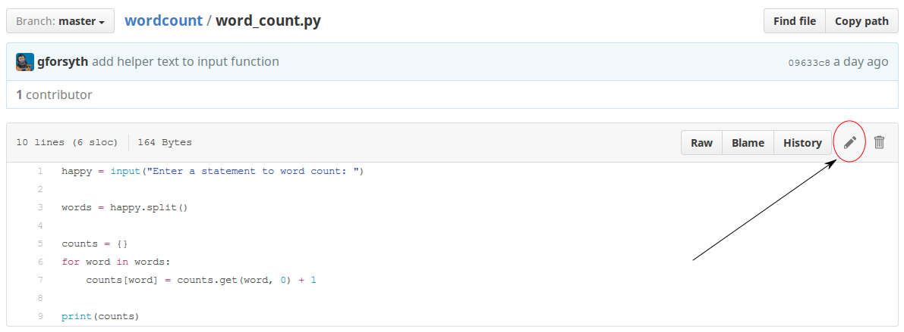

# Git Remotes

One of the features inherent to modern version control systems is their ability
to store your work elsewhere. Backups are important, for one thing. Even more
importantly, the ability to synchronize changes against a remote server allows
collaboration, which is what `git` is all about.

## Create github repo 

First, navigate to [github.com](https://github.com) and log in if you haven't
already. (Or make an account if you need one)







## Add remote to local git repository

Copy and paste the __first__ line from the GitHub snippet into your terminal. 

We are adding a `remote`, that by convention is called `origin` and it points at
`https://github.com/<username>/wordcount.git`

Verify that you have successfully added the remote with

```diff
git remote -v
```
```diff
origin	https://github.com/gforsyth/wordcount.git (fetch)
origin	https://github.com/gforsyth/wordcount.git (push)
```

## `git push`

Now the "distributed" part of "distributed version control system" will start to
make a whole lot more sense. 

Right now, we have a git repository in a folder `wordcount` and it has 3+
commits that we have made to a file called `word_count.py`.

Now we want to transfer that history to our remote host (GitHub). To send
updates to a remote, we `push`.

```diff
git push -u origin master
```

You will be prompted for your username and password, then you should see
something like:

```diff
Counting objects: 9, done.
Delta compression using up to 12 threads.
Compressing objects: 100% (6/6), done.
Writing objects: 100% (9/9), 1006 bytes | 0 bytes/s, done.
Total 9 (delta 1), reused 0 (delta 0)
remote: Resolving deltas: 100% (1/1), done.
Branch master set up to track remote branch master from origin.
To github.com:gforsyth/wordcount.git
 * [new branch]      master -> maste
```

Again, that's a bunch of information.  What did we do?

We told `git` to `push` from `master` on the local machine, to a branch called
`master` on the remote (which is called `origin`).

The `-u` flag is something we do the _first_ time we push a _new_ branch to a
repository, don't worry about it right now, it will reappear later.

Now look at the message from `git`: It did a bunch of stuff that seems to
involve compression -- that's good, because it means it's probably saving us
bandwith and time. 

We also have "branch master set up to track remote branch master from origin".
What does this mean? It means we set the branch called `master` on the remote to
be the _default_ choice for when we `push`! 

That means that next time we make a change and want to update the remote, we can
just do `git push`. Cool!

## What happened on GitHub?

Let's look!



You should see something like the image above.  Cool, huh?

You should see the `word_count.py` file -- try clicking it.

And there's your code! Now hit 'Back' in the browser. You can explore more
later.

Now click where it says "Commits"

You should see something like the following:



There are the commits you made! In fact, the complete history of your repository
was transferred to GitHub when you did a `push`! 

## Edit your script on GitHub

GitHub has a handy little text editor built right in that lets you make changes
to files on the web. Let's try it!

Go back to the main repo page again and again click on `word_count.py`.

Now, click on the pencil icon in the top-right:



Now let's edit the file. Add another `print` statement to the script, just above
the last line, so that the script now reads:

```python
happy = input("Enter a statement to word count: ")

words = happy.split()

counts = {}
for word in words:
    counts[word] = counts.get(word, 0) + 1

print("The word frequency of your statement is: ")
print(counts)
```

Now how do we save this? We have to commit it! We can do this in GitHub's
interface. Scroll down and enter a commit message in the box with the grey text
"Update word_count.py" 

Then click "Commit changes"

## `git pull`

We made a change to the script on GitHub! If you go back to the main repo page,
you'll see that the commit count and incremented by one. 

Now let's check in on the local copy of the repo.

Do you remember how to view the commits we made on the command line?

```diff
$ git log --oneline
```
```diff
09633c8 add helper text to input function
97fba8d allow user input of statement to word count
47f748f Add initial version of word count script
```

Hmmm... only 3 commits? 

The local copy of the repo and the remote are asynchronous. They don't "sync"
the way Google Drive or Dropbox do -- you have to tell them to update. This
might seem like an annoying extra step, but it's necessary. As we will see
later, many different users can edit the same repository and if everyone's
changes are constantly syncing in real time it would be a disaster.

To update the local copy of the repo with the changes we made on GitHub, we use
`git pull`. Makes sense, right? To move changes from the local repo _to_ the
remote, we `push`. To bring them to the local _from_ the remote, we `pull`. 

```diff
$ git pull
```
```diff
git pull
remote: Counting objects: 3, done.
remote: Compressing objects: 100% (2/2), done.
remote: Total 3 (delta 1), reused 0 (delta 0), pack-reused 0
Unpacking objects: 100% (3/3), done.
From github.com:gforsyth/wordcount
   09633c8..2f53c34  master     -> origin/master
Updating 09633c8..2f53c34
Fast-forward
 word_count.py | 1 +
 1 file changed, 1 insertion(+)
```

It worked! Or at least something happened. What does `git log` say now?

```diff
$ git log --oneline
```
```diff
2f53c34 Add user-friendly print statement
09633c8 add helper text to input function
97fba8d allow user input of statement to word count
47f748f Add initial version of word count script
```

There's the new commit! That should mean that `word_count.py` is updated! How
can we quickly check on `word_count.py`? 

```diff
$ cat word_count.py
```
```python
happy = input("Enter a statement to word count: ")

words = happy.split()

counts = {}
for word in words:
    counts[word] = counts.get(word, 0) + 1

print("The word frequency of your statement is: ")
print(counts)
```
